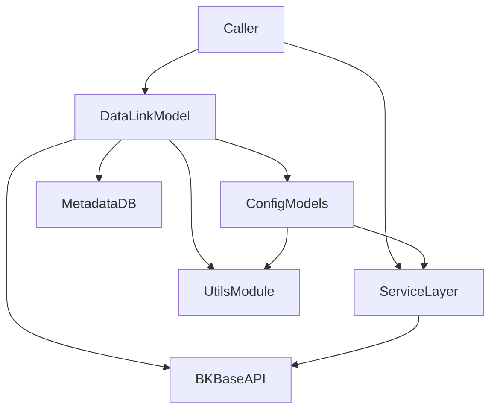
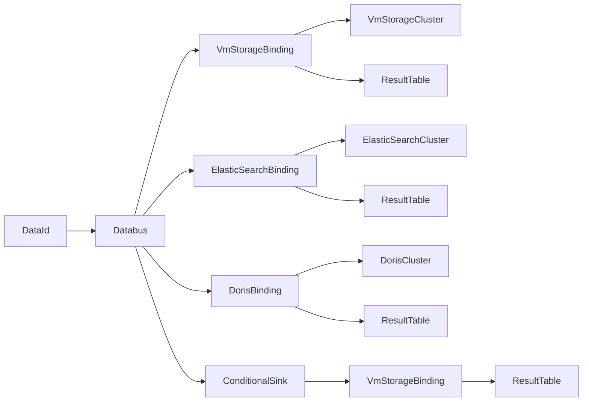
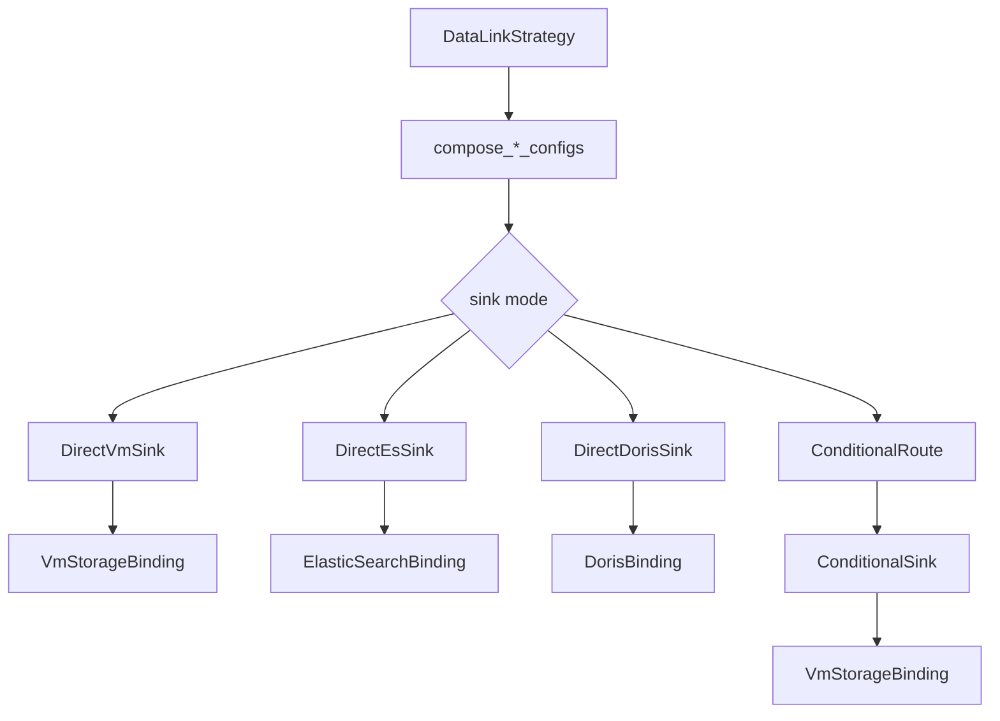

# DataLink 模块说明

## 1. 模块定位

`metadata/models/data_link/` 是监控平台与 BKBase 数据链路平台之间的桥接层，负责：

- 按链路策略组装 BKBase 组件配置；
- 通过 `api.bkdata.apply_data_link` / `api.bkdata.delete_data_link` 下发或删除链路资源；
- 同步监控侧元数据状态（如 `BkBaseResultTable`、`AccessVMRecord`）；
- 对组件状态与配置做统一查询封装。

模块核心是 `DataLink`（编排器）+ `DataLinkResourceConfigBase`（配置模型基类）+ `service.py`（服务入口）。

---

## 2. 目录与职责

- `data_link.py`：`DataLink` 主模型，维护策略枚举、策略分发、链路申请、删除与元数据同步。
- `data_link_configs.py`：配置模型层，定义 `DataId`/`ResultTable`/`StorageBinding`/`Databus` 等组件配置与模板渲染逻辑。
- `service.py`：面向调用方的服务函数（申请 data_id、查询组件状态与配置）。
- `utils.py`：命名规整、模板渲染、字段组装等通用工具。
- `constants.py`：链路类型、资源状态、命名空间、默认转换格式等常量。
- `__init__.py`：对外导出常用模型类。

---

## 3. 核心概念

### 3.1 DataLink（链路编排器）

`DataLink` 代表一条完整链路，`data_link_strategy` 决定采用哪套组装函数（`compose_*_configs`）。

### 3.2 组件配置模型

所有链路组件配置都围绕 `DataLinkResourceConfigBase` 实现，统一提供：

- `compose_config()`：渲染组件配置；
- `delete_config()`：删除 BKBase 组件并删除本地记录；
- `component_status`：实时状态查询；
- `component_config`：BKBase 侧完整配置查询。

### 3.3 Kind / Status / Namespace / Tenant

- `DataLinkKind`：BKBase 组件类型枚举（`DataId`、`ResultTable`、`VmStorageBinding`、`ElasticSearchBinding`、`DorisBinding`、`Databus` 等）。
- `DataLinkResourceStatus`：资源状态（`Initializing`、`Creating`、`Pending`、`Ok`、`Failed`、`Reconciling`、`Terminating`）。
- `namespace`：按数据域隔离，常见为 `bkmonitor`（时序）/ `bklog`（日志）。
- `bk_tenant_id`：租户隔离字段；开启多租户模式时会写入 BKBase 配置中的 `tenant`。

---

## 4. 整体调用关系

### 4.1 组件关联关系图（运行视角）

下面的关系图描述“组件之间如何串起来”，重点是 `Databus` 如何连接上游 `DataId` 与下游各类 Sink。

### 4.2 组件关联关系图（策略分流视角）

不同策略在 `Databus.sinks` 上的差异，是链路分流的核心。

### 4.3 通过哪些配置字段关联

#### A. 本地模型层（Django）关联键

| 关联对象 | 关联字段 | 说明 |
| --- | --- | --- |
| `DataLink` -> 各 `*Config` | `data_link_name` | 同一条链路下的组件实例归组键，删除链路时按它反查组件并逆序清理。 |
| 各 `*Config` 资源唯一键 | `(bk_tenant_id, namespace, name)` | 通过 `update_or_create` 保证幂等更新。 |
| `DataBusConfig` -> Sink 速查 | `sink_names` | 本地存储为 `kind:name` 列表，便于检索与排障。 |

#### B. BKBase 配置层（spec）关联键

| 上游组件 | 下游组件 | 关联字段（实际配置） | 说明 |
| --- | --- | --- | --- |
| `Databus` | `DataId` | `Databus.spec.sources[].name == DataId.metadata.name` | `DataBusConfig.data_id_name` 会写入 source name。 |
| `Databus` | 各类 Binding | `Databus.spec.sinks[].name == Binding.metadata.name` | sinks 由策略组装函数构造。 |
| `Databus` | 各类 Binding | `Databus.spec.sinks[].kind == Binding.kind` | 常见为 `VmStorageBinding` / `ElasticSearchBinding` / `DorisBinding` / `ConditionalSink`。 |
| `VmStorageBinding` | `ResultTable` | `VmStorageBinding.spec.data.name == ResultTable.metadata.name` | 代码里通常用 `self.name` 作为 RT 名。 |
| `VmStorageBinding` | `VmStorage` 集群 | `VmStorageBinding.spec.storage.name == vm_cluster_name` | 由 `VMStorageBindingConfig.vm_cluster_name` 传入。 |
| `ElasticSearchBinding` | `ResultTable` | `ElasticSearchBinding.spec.data.name == ResultTable.metadata.name` | 日志/事件场景常见。 |
| `ElasticSearchBinding` | `ElasticSearch` 集群 | `ElasticSearchBinding.spec.storage.name == storage_cluster_name` | 由 ES 存储配置决定。 |
| `DorisBinding` | `ResultTable` | `DorisBinding.spec.data.name == ResultTable.metadata.name` | 日志写 Doris 时使用。 |
| `DorisBinding` | `Doris` 集群 | `DorisBinding.spec.storage.name == storage_cluster_name` | 由 Doris 存储配置决定。 |
| `ConditionalSink` | 下游 `VmStorageBinding` | `ConditionalSink.spec.conditions[].sinks[].name == VmStorageBinding.metadata.name` | 用于按标签路由到不同 VM Binding。 |

#### C. 命名空间与租户必须同时匹配

除了 `name/kind`，组件关联还依赖 `namespace`（以及多租户模式下的 `tenant`）。  
也就是说，`source/sink/data/storage` 指向同名资源时，必须处于同一 `namespace`（并在多租户模式下使用同一 `tenant`）才能正确解析。

#### D. 两种最典型链路的关联串

1) **标准时序链路**

- `Databus.sources` 指向 `DataId`
- `Databus.sinks` 指向 `VmStorageBinding`
- `VmStorageBinding.spec.data` 指向 `ResultTable`
- `VmStorageBinding.spec.storage` 指向 `VmStorage` 集群

2) **基础采集/联邦子集群链路（条件路由）**

- `Databus.sinks` 先指向 `ConditionalSink`
- `ConditionalSink.conditions[].sinks` 再指向一个或多个 `VmStorageBinding`
- 每个 `VmStorageBinding` 仍通过 `spec.data` 绑定对应 `ResultTable`

---

## 5. 链路策略矩阵

下表以 `DataLink.DATA_LINK_STRATEGY_CHOICES`、`STRATEGY_RELATED_COMPONENTS`、`STORAGE_TYPE_MAP` 为准。

| 策略常量 | 场景 | 组装函数 | 关联组件（策略映射） | 存储类型 |
| --- | --- | --- | --- | --- |
| `BK_STANDARD_V2_TIME_SERIES` | 标准单指标单表时序 | `compose_standard_time_series_configs` | `ResultTableConfig` + `VMStorageBindingConfig` + `DataBusConfig` | `VM` |
| `BK_EXPORTER_TIME_SERIES` | 采集插件时序（Exporter） | `compose_bk_plugin_time_series_config` | `ResultTableConfig` + `VMStorageBindingConfig` + `DataBusConfig` | `VM` |
| `BK_STANDARD_TIME_SERIES` | 采集插件时序（Standard） | `compose_bk_plugin_time_series_config` | `ResultTableConfig` + `VMStorageBindingConfig` + `DataBusConfig` | `VM` |
| `BCS_FEDERAL_PROXY_TIME_SERIES` | 联邦代理集群时序 | `compose_bcs_federal_proxy_time_series_configs` | `ResultTableConfig` + `VMStorageBindingConfig` | `VM` |
| `BCS_FEDERAL_SUBSET_TIME_SERIES` | 联邦子集群时序 | `compose_bcs_federal_subset_time_series_configs` | `ResultTableConfig` + `VMStorageBindingConfig` + `ConditionalSinkConfig` + `DataBusConfig` | `VM` |
| `BASEREPORT_TIME_SERIES_V1` | 主机基础采集时序 | `compose_basereport_time_series_configs` | `ResultTableConfig` + `VMStorageBindingConfig` + `ConditionalSinkConfig` + `DataBusConfig` | `VM` |
| `BASE_EVENT_V1` | 基础事件 | `compose_base_event_configs` | `ResultTableConfig` + `ESStorageBindingConfig` + `DataBusConfig` | `ES` |
| `SYSTEM_PROC_PERF` | 系统进程性能 | `compose_system_proc_configs` | `ResultTableConfig` + `VMStorageBindingConfig` + `DataBusConfig` | `VM` |
| `SYSTEM_PROC_PORT` | 系统进程端口 | `compose_system_proc_configs` | `ResultTableConfig` + `VMStorageBindingConfig` + `DataBusConfig` | `VM` |
| `BK_LOG` | 日志链路 | `compose_log_configs` | `ResultTableConfig` + `ESStorageBindingConfig` + `DorisStorageBindingConfig` + `DataBusConfig` | `ES` |
| `BK_STANDARD_V2_EVENT` | 标准自定义事件 | `compose_custom_event_configs` | `ResultTableConfig` + `ESStorageBindingConfig` + `DataBusConfig` | `ES` |

说明：

- 联邦子集群策略在组装阶段重点产出 `ConditionalSink` + `Databus` 路由配置；其策略映射中仍包含其他组件类型，用于统一生命周期管理和清理。
- 日志链路支持 ES 与 Doris，至少需要一个存储绑定，否则抛出 `ValueError("至少需要一个存储绑定配置")`。

---

## 6. 核心流程

### 6.1 创建链路（`DataLink.apply_data_link`）

1. 预创建或获取 `BkBaseResultTable`，状态初始化为 `Initializing`。
2. 执行 `compose_configs()`，根据策略分发到对应 `compose_*_configs`。
3. 在事务中 `update_or_create` 各组件本地配置模型。
4. 调用各组件 `compose_config()` 渲染最终下发 JSON。
5. 通过 `apply_data_link_with_retry()`（4 次指数退避）调用 BKBase API 下发。
6. 调用侧可继续执行 `sync_metadata()` / `sync_basereport_metadata()` 同步元数据。

### 6.2 删除链路（`DataLink.delete_data_link`）

1. 从 `STRATEGY_RELATED_COMPONENTS` 取当前策略对应组件列表。
2. 逆序遍历组件类型并查询 `data_link_name` 相关实例。
3. 对每个组件执行 `delete_config()`（先删 BKBase，再删本地）。
4. 最后删除 `DataLink` 本身。

### 6.3 状态与配置查询

- 配置模型属性 `component_status` -> `service.get_data_link_component_status`。
- 配置模型属性 `component_config` -> `service.get_data_link_component_config`。
- 状态查询会走 `get_bkbase_component_status_with_retry`（4 次指数退避）。

### 6.4 基础采集链路特点

- 基于 `BASEREPORT_USAGES`（11 个 usage）批量生成配置；
- 每个 usage 同时生成普通与 `_cmdb` 两套 RT + VMBinding；
- 通过 `ConditionalSink` 按 `__result_table` 路由，再由 `Databus` 统一消费。

---

## 7. 主要模型与接口速查

### 7.1 `DataLink` 关键方法

- `compose_configs(...)`：策略分发入口。
- `apply_data_link(...)`：链路申请主流程。
- `apply_data_link_with_retry(configs)`：重试下发。
- `delete_data_link()`：链路删除。
- `sync_metadata(data_source, table_id, storage_cluster_name)`：普通链路元数据同步。
- `sync_basereport_metadata(...)`：基础采集链路元数据同步。

### 7.2 `service.py` 关键函数

- `apply_data_id_v2(...)`：申请 DataId 组件并落库。
- `get_data_id_v2(...)`：获取 data_id 与状态，`Ok` 时回填 `DataIdConfig.bk_data_id`。
- `get_data_link_component_status(...)`：获取组件状态。
- `get_data_link_component_config(...)`：获取组件完整配置。

### 7.3 配置模型（`data_link_configs.py`）

- 基类：`DataLinkResourceConfigBase`。
- 常用子类：
  - `DataIdConfig`
  - `ResultTableConfig`
  - `VMStorageBindingConfig`
  - `ESStorageBindingConfig`
  - `DorisStorageBindingConfig`
  - `DataBusConfig`
  - `ConditionalSinkConfig`
  - `ClusterConfig`（用于集群注册到 BKBase）
- 组件映射：`COMPONENT_CLASS_MAP`。
- 已标记废弃：`LogDataBusConfig`、`LogResultTableConfig`（使用统一新模型替代）。

---

## 8. 配置渲染与命名规则

### 8.1 配置渲染

- 所有组件配置通过 `utils.compose_config(tpl, render_params, ...)` 渲染 Jinja2 模板并转 JSON。
- 若模板渲染后 JSON 解析失败，返回空字典并记录错误日志。

### 8.2 DataId 命名（`compose_bkdata_data_id_name`）

- 先清洗特殊字符，再处理中文拼音；
- 空格去除，`-` 转 `_`，连续下划线压缩；
- 长度受限时会截断并追加 5 位 MD5 后缀；
- 联邦子集群策略会额外加 `fed_` 前缀。

### 8.3 ResultTable 命名（`compose_bkdata_table_id`）

- 去除 `.__default__` 后缀并转小写；
- `-`、`.` 转 `_`，中文转拼音；
- 负数前缀场景改写为 `bkm_neg_...`；
- 结果名整体受 BKBase 40 长度限制，超长时截断并追加哈希；
- 联邦子集群策略会加 `_fed` 后缀。

---

## 9. 扩展指南

### 9.1 新增链路策略

1. 在 `DataLink` 中新增策略常量与 `DATA_LINK_STRATEGY_CHOICES` 条目。
2. 在 `STRATEGY_RELATED_COMPONENTS` 添加策略组件映射。
3. 在 `STORAGE_TYPE_MAP` 中定义对应存储类型。
4. 新增 `compose_xxx_configs(...)` 实现，遵循事务内 `update_or_create` + 组件 `compose_config()`。
5. 在 `compose_configs()` 的 `switcher` 注册新策略分发。
6. 若是插件时序类策略，按需补充 `DATABUS_TRANSFORMER_FORMAT` 映射。

### 9.2 新增组件配置类型

1. 在 `constants.py` 扩展 `DataLinkKind`。
2. 新建配置模型，继承 `DataLinkResourceConfigBase`，实现 `compose_config()`。
3. 在 `COMPONENT_CLASS_MAP` 注册新组件类型。
4. 在对应策略映射中引入该组件，并补齐链路组装与删除流程。

### 9.3 集群配置同步

- 使用 `ClusterConfig.sync_cluster_config(cluster)` 将 Kafka/ES 等集群注册到 BKBase；
- Kafka 会同步到 `bklog` 与 `bkmonitor` 两个 namespace；
- 同步成功后会更新 `cluster.registered_to_bkbase = True`。

---

## 10. 常见问题与排障

### 10.1 下发失败或重试耗尽

- 关注 `apply_data_link_with_retry` 与 `get_bkbase_component_status_with_retry` 的日志；
- 确认 `kind/name/namespace/bk_tenant_id` 组合是否正确；
- 检查模板渲染是否返回空配置（JSON 解析失败场景）。

### 10.2 组件状态长期不是 `Ok`

- 通过 `component_config` 查看 BKBase 侧完整配置；
- 核查依赖组件是否完整（例如日志链路缺少存储绑定）；
- 核查集群是否已完成 `ClusterConfig.sync_cluster_config`。

### 10.3 日志链路创建报错“至少需要一个存储绑定配置”

- 检查 ES 与 Doris 存储配置是否至少存在其一；
- 检查 `ResultTableOption.OPTION_V4_LOG_DATA_LINK` 中的存储配置是否启用。

### 10.4 命名与实际不一致

- 先确认是否触发清洗、拼音转换或长度截断；
- 联邦子集群场景需额外关注 `fed_` / `_fed` 前后缀；
- 对历史链路可用 `get_bkbase_raw_data_id_name` 做兼容回退查询。

### 10.5 联邦子集群链路未生效

- 检查 `BcsFederalClusterInfo` 是否存在且 `is_deleted=False`；
- 若未匹配到联邦拓扑，`compose_bcs_federal_subset_time_series_configs` 会直接返回空配置列表。

---

## 11. 维护注意事项

- 事务：策略组装普遍依赖 `transaction.atomic`，避免部分配置写入。
- 幂等：优先使用 `update_or_create`，避免重复创建同名组件。
- 删除顺序：务必按组件逆序删除，降低依赖链清理风险。
- 多租户：`ENABLE_MULTI_TENANT_MODE=True` 时需确保 tenant 透传一致。
- 兼容性：涉及 V3 -> V4 场景时，优先走兼容函数（如 raw_data_name 回退逻辑）。

---

## 12. 相关文件

- `metadata/models/data_link/data_link.py`
- `metadata/models/data_link/data_link_configs.py`
- `metadata/models/data_link/service.py`
- `metadata/models/data_link/utils.py`
- `metadata/models/data_link/constants.py`

